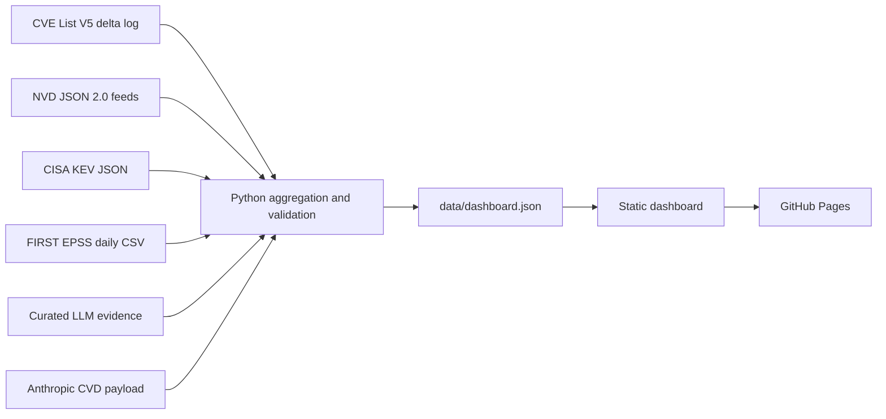

# VulnSignal

[](https://github.com/llody9977/vulnsignal/actions/workflows/data-refresh.yml)
[](https://github.com/llody9977/vulnsignal/actions/workflows/pages.yml)

I built VulnSignal as a personal project to examine trends in published vulnerability records, CISA KEV additions, public exploit-reference signals and selected LLM-assisted disclosure reports.

**Live dashboard:** [llody9977.github.io/vulnsignal](https://llody9977.github.io/vulnsignal/)

[](https://llody9977.github.io/vulnsignal/)

## What it shows

- Year, month and aligned year-on-year views of CVEs published by NVD.
- Monthly CVSS severity, CISA KEV additions, NVD exploit-tagged references and CVEs above a project-defined EPSS threshold.
- Exact monthly values alongside the chart, including separate CVSS `NONE` and unscored records.
- Source dates, a snapshot ID and content fingerprints for the inputs used to build each release.
- Median and 75th-percentile time to KEV for an explicitly stated mature cohort.
- Ransomware use, remediation due windows and the age of KEV additions over the latest 12 complete months.
- Trailing-12-month CWE shares compared with the previous 12 months.
- First-party LLM-assisted disclosure events shown as separate reported minimums, not a combined discovery total.

## Why I built it

The upstream sources answer different questions and mature at different speeds. NVD publication volume measures published records rather than the underlying incidence of vulnerable software. Recent exploit-reference counts can also appear lower while NVD continues enriching those records. Changes in CNA participation and reporting processes may increase publication counts even when the underlying security environment has not changed at the same rate.

VulnSignal brings these signals together while reducing known measurement artefacts:

- Recent exploit-reference months remain visible but are marked as enriching. Comparisons are withheld until the selected periods contain mature data.
- KEV timing is calculated only for CVEs with a complete observation period.
- KEV-addition measures use their own latest-12-month window rather than borrowing the CVE maturity cohort.
- LLM programme claims remain separate because the disclosed sets may overlap and the public sources do not support reliable deduplication.

## Scope and limitations

VulnSignal is a daily analytical snapshot, not a real-time advisory or patch-prioritisation feed. Publication growth does not necessarily mean that software is becoming vulnerable at the same rate, and an NVD reference tagged `Exploit` does not prove that linked code works.

CVE, NVD and KEV do not reliably record how a vulnerability was discovered. The LLM timeline therefore contains only reviewed first-party programme reports or public CVE-ID releases. A blank month means that the registry has no recorded disclosure event; it does not mean zero LLM-assisted discoveries. Programme counts are never added together unless overlaps can be removed reliably.

The optional `--as-of` value is a report cutoff, not a complete historical archive. It excludes later NVD publications and KEV events, while source freshness, NVD severity, CWE, exploit-reference and current EPSS fields still reflect the downloaded source snapshots. The dataset build time remains the actual time when the report was generated.

## Data sources and freshness

VulnSignal downloads directly from official and first-party public sources. Downloaded source archives are cached for validation and repeatable processing; the aggregate generated from them is committed as `data/dashboard.json`.

| Source | Dashboard use | Official endpoint |
| --- | --- | --- |
| CVE Program, CVE List V5 | Source freshness and records changed during the previous 24 hours | [CVE List downloads](https://www.cve.org/Downloads) and [CVEProject/cvelistV5](https://github.com/CVEProject/cvelistV5) |
| NIST National Vulnerability Database | Published CVEs, CVSS severity, CWE and references tagged as exploits | [NVD JSON 2.0 data feeds](https://nvd.nist.gov/vuln/data-feeds) |
| CISA Known Exploited Vulnerabilities | Known-exploited membership, catalogue additions, remediation due dates and ransomware-use labels | [CISA KEV catalogue](https://www.cisa.gov/known-exploited-vulnerabilities-catalog) and [JSON feed](https://www.cisa.gov/sites/default/files/feeds/known_exploited_vulnerabilities.json) |
| FIRST EPSS | Current exploitation-probability scores joined to published CVEs | [FIRST EPSS data and statistics](https://www.first.org/epss/data_stats) and [current CSV feed](https://epss.empiricalsecurity.com/epss_scores-current.csv.gz) |
| Anthropic coordinated disclosure | Machine-readable programme minimum and public CVE identifiers for Claude Mythos Preview findings | [Anthropic CVD payload](https://red.anthropic.com/2026/cvd/data/payload.json) |
| Curated LLM evidence register | Reviewed first-party programme claims, including OpenAI Aardvark | [`data/llm-discovery-evidence.json`](data/llm-discovery-evidence.json) |

The page distinguishes the dashboard build time from upstream source dates. For EPSS, it records the model version and `score_date` from the downloaded feed. The refresh rejects stale or structurally invalid EPSS data rather than labelling the dashboard build time as the EPSS update time.

Every NVD yearly feed is checked against the SHA-256 value in its official META file. The pipeline calculates content fingerprints for the CVE List delta, CISA KEV, FIRST EPSS, Anthropic payload and curated LLM register. A fingerprint identifies the exact input used; it is not independent proof that an upstream source is complete or free from later revisions.

This product uses data from NVD but is not endorsed or certified by NVD.

## How to interpret the metrics

| Metric | Meaning and limitation |
| --- | --- |
| Published CVEs | Active NVD records grouped by publication month; rejected records are excluded. This measures publication activity, not vulnerability incidence. |
| Severity | Primary assessments are preferred over secondary assessments. Within that class, versions are checked in order: CVSS v4.0, v3.1, v3.0, then v2. Scores are not maximised. CVSS `NONE` (0.0) is kept separate from records without a score. |
| Public exploit reference | The NVD record has a reference tagged `Exploit`. Raw recent counts remain visible and marked as enriching; comparisons are withheld when either selected period lacks mature data. |
| KEV | CISA has placed the CVE in its Known Exploited Vulnerabilities catalogue. This confirms known exploitation and is distinct from an NVD exploit-tagged reference. |
| Time to KEV | Median and 75th-percentile days from NVD publication to CISA listing, calculated for KEV-matched records in the displayed mature cohort. Listings that predate NVD publication count as zero days and remain visible as source-timing exceptions. |
| EPSS ≥ 0.1 | A project-defined threshold applied to the current FIRST EPSS snapshot. Monthly and 36-month groups use each CVE's NVD publication month, so they are not historical EPSS scores as they stood in those months. |
| Common CWE classes | Each CVE contributes once to every distinct valid CWE assigned in NVD. The dashboard compares shares of published CVEs, because raw counts are affected by changes in total publication volume. |
| Earlier versus recent | Two adjacent 36-month publication periods ending at the latest complete month. This compares publication, severity, matured exploit-reference and current-snapshot EPSS signals; it does not measure an LLM discovery rate. |
| LLM evidence | Sparse first-party programme report or public-CVE-ID release events. Dates are disclosure dates rather than discovery dates, and programme totals are not summed. |

## Data pipeline



`app/page.tsx` imports the generated dataset directly. The daily workflow downloads and validates the inputs, runs the complete test suite and produces the GitHub Pages export. It commits `data/dashboard.json` only when the validated generated output differs. The Pages workflow also checks the current clock and refuses to deploy a dashboard, CVE List, NVD or EPSS snapshot beyond its freshness limit. If a download, freshness check or reconciliation fails, the last successful snapshot remains published.

## GitHub automation

- `Refresh vulnerability data` runs daily at 09:17 UTC (17:17 SGT) and can also be started manually. It refreshes CVE, NVD, CISA KEV, FIRST EPSS and first-party LLM evidence before validating the aggregate.
- `Deploy VulnSignal to GitHub Pages` runs for pushes to `main`, manual runs and successful data-refresh runs. The successful-refresh trigger is necessary because a commit made with the workflow token does not start another workflow automatically.

All third-party GitHub Actions are pinned to full commit SHAs.

## Development

Requirements:

- Node.js 22.13 or later
- Python 3.11 or later

```bash
npm ci
npm run dev
```

The committed dataset lets the dashboard start without downloading the upstream feeds. The first full refresh downloads the yearly NVD archives and can take 30 minutes or more. Later runs reuse verified cached inputs where appropriate.

```bash
npm run data:sync
npm run evidence:check
npm run data:check
```

To include publication data before 2019:

```bash
python3 scripts/sync_vulnerability_data.py --from-year 2010
```

| Command | Purpose |
| --- | --- |
| `npm run dev` | Start the development dashboard. |
| `npm run data:sync` | Pull official sources and rebuild `data/dashboard.json`. |
| `npm run evidence:check` | Validate the curated LLM register against its JSON Schema. |
| `npm run data:check` | Validate the generated dataset without network access. |
| `npm run data:check:freshness` | Apply the deployment-time freshness gates to the generated dataset. |
| `npm run lint` | Run static checks. |
| `npm test` | Build the app and run application and pipeline tests. |
| `npm run check` | Run the full local verification suite. |
| `npm run build:pages` | Produce the static GitHub Pages site in `out/`. |

## Project layout and hosting

```text
app/                                Dashboard UI
data/dashboard.json                 Generated aggregate consumed by the UI
data/llm-discovery-evidence.json    Curated evidence register
data/llm-discovery-evidence.schema.json  Register contract
scripts/sync_vulnerability_data.py  Source ingestion and aggregation
tests/                              Application and pipeline tests
.github/workflows/                  Daily refresh and GitHub Pages deployment
.openai/hosting.json                Optional Sites preview configuration
build/ and worker/                  Optional Vinext/Sites runtime support
```

GitHub Pages is the canonical public deployment. The Vinext, Worker and `.openai/hosting.json` files support an optional Sites-compatible preview; they do not replace the GitHub Pages workflow.

See [CONTRIBUTING.md](CONTRIBUTING.md) before changing metric definitions or source handling. VulnSignal is released under the [MIT Licence](LICENSE).
