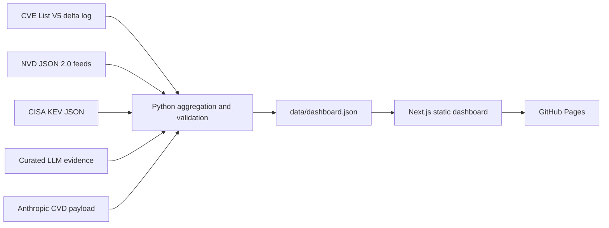

# VulnSignal

[](https://github.com/llody9977/vulnsignal/actions/workflows/data-refresh.yml)
[](https://github.com/llody9977/vulnsignal/actions/workflows/pages.yml)

VulnSignal is an open-source dashboard for monthly CVE publications, CVSS
severity, CVEs with public exploit references, CISA Known Exploited
Vulnerabilities (KEV) additions and documented LLM-assisted disclosures. It
supports year, month and year-on-year views on one monthly timeline.

**Live dashboard:** [llody9977.github.io/vulnsignal](https://llody9977.github.io/vulnsignal/)

## What the dashboard reports

- Year, month and aligned year-on-year report modes.
- A unified CVE, KEV, exploit-reference and documented LLM disclosure chart.
- Critical, high, medium, low, and unscored monthly severity lines.
- An exact-value signal matrix aligned to the chart months.
- Filtered publication volume, severity, exploit, KEV, coverage, peak, and momentum indicators.
- The share of mature CVEs added to KEV and the time from NVD publication to
  CISA listing.
- Two adjacent 36-month periods showing how publication, severity, exploit and
  KEV indicators changed over time.
- A documented lower bound for LLM-assisted CVEs and the number of public CVE
  IDs in the first-party source.
- A snapshot ID, an input fingerprint and the update, release or review date
  recorded for each source.
- Severity coverage, leading CWEs and recently added KEVs.

## Data provenance

VulnSignal downloads data directly from official and first-party public
sources. Downloaded archives are kept in `.cache/`; only the aggregate
dashboard dataset is stored in the repository.

| Source | Dashboard use | Official endpoint |
| --- | --- | --- |
| CVE Program, CVE List V5 | CVE source freshness and records changed during the last 24 hours | [CVE List downloads](https://www.cve.org/Downloads) and [CVEProject/cvelistV5](https://github.com/CVEProject/cvelistV5) |
| NIST National Vulnerability Database | Published CVEs, CVSS severity, CWE, and references tagged as exploits | [NVD JSON 2.0 data feeds](https://nvd.nist.gov/vuln/data-feeds) |
| CISA Known Exploited Vulnerabilities | Known-exploited membership, catalog additions, remediation due dates, and ransomware-use labels | [CISA KEV catalog](https://www.cisa.gov/known-exploited-vulnerabilities-catalog) and its [JSON feed](https://www.cisa.gov/sites/default/files/feeds/known_exploited_vulnerabilities.json) |
| Anthropic coordinated disclosure | First-party machine-readable CVE counts and public CVE identifiers for Claude Mythos Preview findings | [Anthropic CVD payload](https://red.anthropic.com/2026/cvd/data/payload.json) |
| Curated LLM evidence registry | Reviewed first-party programme claims and public CVE-ID evidence, including OpenAI Aardvark | [`data/llm-discovery-evidence.json`](data/llm-discovery-evidence.json) |

This product uses data from the NVD API but is not endorsed or certified by
the NVD. NVD content can change as records are enriched or reassessed.

### Accuracy and freshness

The dashboard shows real source data, but it is a daily snapshot rather than a
real-time feed. The snapshot ID on the page shows when the aggregate was
built. The source cards distinguish feed updates, a catalogue release, the
Anthropic payload date and the date when the curated LLM register was reviewed.

Publication volume, severity, CWE and exploit-reference figures are based on
active NVD records. The CVE List V5 delta log is used separately for CVE source
activity and freshness. This distinction is shown in the dashboard because the
two sources have different roles.

The pipeline verifies every NVD yearly feed against the SHA-256 value in its
official META file. For the CVE List delta, CISA KEV, Anthropic payload and the
curated LLM register, it records locally calculated snapshot fingerprints.
Those fingerprints identify the exact content used; they are not independent
proof that an upstream file is complete or correct, and upstream records may
be revised later.

The optional `--as-of` value is a report cutoff, not a complete historical
archive. It excludes CVE delta and KEV events after the cutoff, while NVD
severity, CWE and reference fields still reflect the downloaded NVD snapshot.

`app/page.tsx` imports `data/dashboard.json` directly. The daily refresh
workflow rebuilds and validates this file, commits it when the source data has
changed, and its successful completion triggers a new GitHub Pages build. If
an upstream download or validation fails, the existing page remains on the
last successful snapshot and its snapshot ID remains visible.

## Interpreting the metrics

| Metric | Meaning and limitation |
| --- | --- |
| Published CVEs | Active NVD records grouped by their publication month; rejected records are excluded. |
| Severity | Primary assessments are preferred over secondary assessments. Within that class, versions are checked in order: CVSS v4.0, v3.1, v3.0, then v2. Scores are not maximized. |
| Public exploit reference | The NVD record has a reference tagged `Exploit`. This is a useful public-availability signal, not proof that exploit code works or affects every configuration. |
| KEV | CISA has placed the CVE in its Known Exploited Vulnerabilities catalog. This is distinct from an exploit-tagged reference. |
| Added to KEV within 90 days | The CVE was added to the KEV catalog within 90 days of its NVD publication timestamp. This is listing timing, not the unknown date exploitation began. Recent CVEs without a complete 90-day observation period are excluded from the denominator. If a KEV listing predates the NVD publication date, it is counted as zero days and reported as a source-timing exception. |
| Time to KEV | Median and 75th percentile days are calculated only for KEV-matched records in the stated mature cohort. The dashboard shows this sample size. |
| Common CWE classes | Each CVE is counted once for every distinct valid CWE assigned in NVD. A CVE with more than one CWE can therefore contribute to more than one class. |
| Earlier versus recent comparison | Two adjacent 36-month periods ending at the latest complete month. This is a rolling comparison of publication and cataloguing trends, not a measure of how many vulnerabilities were found by LLMs. |
| LLM evidence timeline | Sparse first-party programme report or public-CVE-ID reveal events. These are evidence publication dates, not vulnerability discovery dates, and programme totals are never summed. |

> [!IMPORTANT]
> CVE, NVD and KEV do not reliably record how a vulnerability was discovered.
> VulnSignal therefore shows an LLM-assisted count only when a first-party
> source states it. Counts from different programmes remain separate unless
> overlaps can be removed reliably. The registry is curated, not exhaustive; a
> blank month means no disclosure event is recorded, not zero LLM-assisted
> discoveries.

## Data flow



## Run locally

Requirements:

- Node.js 22.13 or later
- Python 3.11 or later

```bash
npm ci
npm run dev
```

The repository includes a generated dataset, so the dashboard can start
without downloading the upstream feeds. To refresh it locally:

```bash
npm run data:sync
npm run evidence:check
npm run data:check
```

The first refresh downloads the annual NVD archives and can take 30 minutes or
more, depending on download speed and source availability. Later runs consult NVD
metadata and reuse `.cache/` where possible.
To include publication data before 2019, pass an earlier starting year:

```bash
python3 scripts/sync_vulnerability_data.py --from-year 2010
```

Useful commands:

| Command | Purpose |
| --- | --- |
| `npm run dev` | Start the local dashboard. |
| `npm run data:sync` | Pull official sources and rebuild `data/dashboard.json`. |
| `npm run evidence:check` | Validate the curated LLM register against its JSON Schema. |
| `npm run data:check` | Validate the existing generated dataset without network access. |
| `npm run lint` | Run static checks. |
| `npm test` | Build the app and run application and pipeline tests. |
| `npm run check` | Run the full local verification suite. |
| `npm run build:pages` | Produce the static GitHub Pages site in `out/`. |

## GitHub automation

The repository uses two GitHub Actions workflows:

- `Refresh vulnerability data` runs every day at 09:17 UTC (17:17 SGT) and can
  also be run manually. It restores a source cache, downloads the official CVE,
  NVD, CISA and first-party LLM disclosure sources, validates the aggregate,
  runs the full test suite, builds the Pages export and commits only
  `data/dashboard.json` when every check passes.
- `Deploy VulnSignal to GitHub Pages` runs for pushes to `main`, manual runs
  and successful data-refresh runs. The successful-refresh trigger is required
  because GitHub does not start another workflow from a commit pushed with the
  workflow token. The Pages build therefore includes the new dataset only
  after the refresh checks have passed.

## Project layout

```text
app/                              Dashboard UI
build/                            Build scripts for alternative deployments (Vite plugins)
data/dashboard.json               Generated aggregate consumed by the UI
data/llm-discovery-evidence.json  Curated evidence registry
data/llm-discovery-evidence.schema.json  Registry contract
scripts/sync_vulnerability_data.py  Source ingestion and aggregation
tests/                            Application and pipeline tests
worker/                           Cloudflare Worker entry point for alternative hosting
.github/workflows/                Daily refresh and Pages deployment
vite.config.ts                    Vite configuration for Cloudflare Worker deployment
wrangler.toml                     Cloudflare Wrangler deployment config (alternative hosting)
.openai/                          OpenAI deployment configuration
```

*Note on deployment:* While the canonical production site is built and served statically via GitHub Pages using `next build` (configured in `.github/workflows/pages.yml`), the repository also contains dual-deploy scaffolding (`worker/`, `vite.config.ts`, `build/`, and `.openai/`) to support alternative hosting environments (such as Cloudflare Workers or OpenAI GPT hosting).

See [CONTRIBUTING.md](CONTRIBUTING.md) before changing metric definitions or
source handling. VulnSignal is released under the [MIT License](LICENSE).
