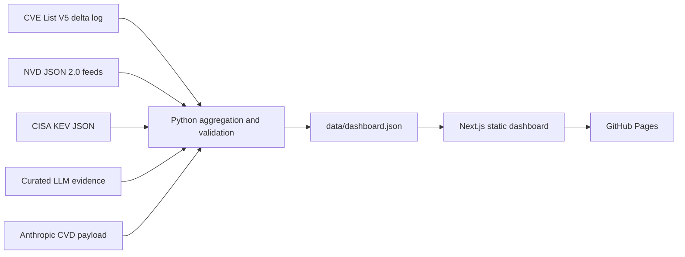

# VulnSignal

[](https://github.com/llody9977/vulnsignal/actions/workflows/data-refresh.yml)
[](https://github.com/llody9977/vulnsignal/actions/workflows/pages.yml)

VulnSignal is an open vulnerability-trend dashboard for CVE publication,
severity, public exploit signals, and CISA Known Exploited Vulnerabilities
(KEV). Its tile-based views pair current indicators with trend lines and a
clearly bounded comparison around the public ChatGPT release.

The recommended GitHub repository name is `vulnsignal`; the product name is
**VulnSignal**.

## What the dashboard reports

- CVEs published by month, with month-over-month movement.
- Critical and high severity counts and share of scored records.
- Public exploit-reference signals and new KEV additions.
- KEV conversion and time-to-KEV for mature CVE cohorts.
- A fixed 36-month comparison before and after the public ChatGPT release.
- A documented lower bound for LLM-assisted CVEs plus the count of public, ID-level records.
- Source freshness, severity coverage, leading CWEs, and recently added KEVs.

## Data provenance

VulnSignal downloads data directly from official public sources. Downloaded
archives are kept in `.cache/`; only the aggregate dashboard dataset is stored
in git.

| Source | Dashboard use | Official endpoint |
| --- | --- | --- |
| CVE Program, CVE List V5 | CVE source freshness and records changed during the last 24 hours | [CVE List downloads](https://www.cve.org/Downloads) and [CVEProject/cvelistV5](https://github.com/CVEProject/cvelistV5) |
| NIST National Vulnerability Database | Published CVEs, CVSS severity, CWE, and references tagged as exploits | [NVD JSON 2.0 data feeds](https://nvd.nist.gov/vuln/data-feeds) |
| CISA Known Exploited Vulnerabilities | Known-exploited membership, catalog additions, remediation due dates, and ransomware-use labels | [CISA KEV catalog](https://www.cisa.gov/known-exploited-vulnerabilities-catalog) and its [JSON feed](https://www.cisa.gov/sites/default/files/feeds/known_exploited_vulnerabilities.json) |
| Anthropic coordinated disclosure | Daily first-party machine-readable CVE counts and public CVE identifiers for Claude Mythos Preview findings | [Anthropic CVD payload](https://red.anthropic.com/2026/cvd/data/payload.json) |
| Curated LLM evidence registry | Reviewed first-party program claims, including OpenAI Aardvark, plus future ID-level evidence | [`data/llm-discovery-evidence.json`](data/llm-discovery-evidence.json) |

This product uses data from the NVD API but is not endorsed or certified by
the NVD. NVD content can change as records are enriched or reassessed.

## Interpreting the metrics

| Metric | Meaning and limitation |
| --- | --- |
| Published CVEs | Active NVD records grouped by their publication month; rejected records are excluded. |
| Severity | Primary assessments are preferred over secondary assessments. Within that class, versions are checked in order: CVSS v4.0, v3.1, v3.0, then v2. Scores are not maximized. |
| Public exploit reference | The NVD record has a reference tagged `Exploit`. This is a useful public-availability signal, not proof that exploit code works or affects every configuration. |
| KEV | CISA has placed the CVE in its Known Exploited Vulnerabilities catalog. This is distinct from an exploit-tagged reference. |
| Added to KEV within 90 days | The CVE was added to the KEV catalog within 90 days of its NVD publication timestamp. This is catalog-entry timing, not the unknown date exploitation began. Recent CVEs without a complete 90-day observation period are excluded from the denominator. |
| Pre/post comparison | December 2019–November 2022 versus December 2022–November 2025, split at the public ChatGPT release on 2022-11-30. |

> [!IMPORTANT]
> The pre/post view is descriptive, not causal. CVE volume can change because
> of reporting participation, software exposure, disclosure practices, NVD
> enrichment, and many other factors. CVE, NVD, and KEV do not contain a
> dependable field identifying vulnerabilities discovered by an LLM.
> VulnSignal therefore never infers LLM discovery from timing or text. An LLM
> count is shown only when supported by explicit primary-source evidence. The
> headline uses the largest documented program lower bound and never sums
> programs without a cross-program deduplication key; program-level counts are
> kept separate from public CVE-level records. The
> registry is curated and non-exhaustive, so a blank count is not evidence that
> no LLM-assisted discoveries occurred.

## Data flow



## Run locally

Requirements:

- Node.js 22.13 or later
- Python 3.11 or later

```bash
npm ci
npm run dev
```

The repository includes a generated dataset, so the dashboard can start
without downloading the upstream feeds. To refresh it locally:

```bash
npm run data:sync
npm run data:check
```

The first refresh downloads the annual NVD archives and can take several
minutes. Later runs consult NVD metadata and reuse `.cache/` where possible.
Use an earlier starting year only when intentionally expanding coverage:

```bash
python3 scripts/sync_vulnerability_data.py --from-year 2010
```

Useful commands:

| Command | Purpose |
| --- | --- |
| `npm run dev` | Start the local dashboard. |
| `npm run data:sync` | Pull official sources and rebuild `data/dashboard.json`. |
| `npm run data:check` | Validate the existing generated dataset without network access. |
| `npm run lint` | Run static checks. |
| `npm test` | Build the app and run application and pipeline tests. |
| `npm run check` | Run the full local verification suite. |
| `npm run build:pages` | Produce the static GitHub Pages site in `out/`. |

## GitHub automation

Two workflows make the repository self-updating:

- `Refresh vulnerability data` runs every day at 09:17 UTC and can also be run
  manually. It restores a source cache, downloads the official CVE, NVD,
  CISA, and first-party LLM-disclosure inputs, validates the aggregate, runs pipeline unit tests, and commits
  only `data/dashboard.json` when it changes.
- `Deploy VulnSignal to GitHub Pages` runs for pushes to `main`, manual runs,
  and successful data-refresh runs. It builds the static export and deploys it
  through GitHub Pages.

For a new repository:

1. Create a repository named `vulnsignal` without pushing yet.
2. In **Settings → Pages**, set the build source to **GitHub Actions**.
3. In **Settings → Actions → General**, allow read and write workflow
   permissions so the refresh workflow can commit its generated dataset.
4. Push this project to `main` so the first Pages deployment starts with the
   repository already configured.
5. Run **Refresh vulnerability data** once from the Actions tab, or wait for
   the daily schedule.

If branch protection blocks direct workflow commits, explicitly allow the
GitHub Actions bot for this generated-data path or adapt the refresh workflow
to open a pull request instead.

## Project layout

```text
app/                              Dashboard UI
data/dashboard.json               Generated aggregate consumed by the UI
data/llm-discovery-evidence.json  Curated evidence registry
data/llm-discovery-evidence.schema.json  Registry contract
scripts/sync_vulnerability_data.py  Source ingestion and aggregation
tests/                            Application and pipeline tests
.github/workflows/                Daily refresh and Pages deployment
```

See [CONTRIBUTING.md](CONTRIBUTING.md) before changing metric definitions or
source handling. VulnSignal is released under the [MIT License](LICENSE).
